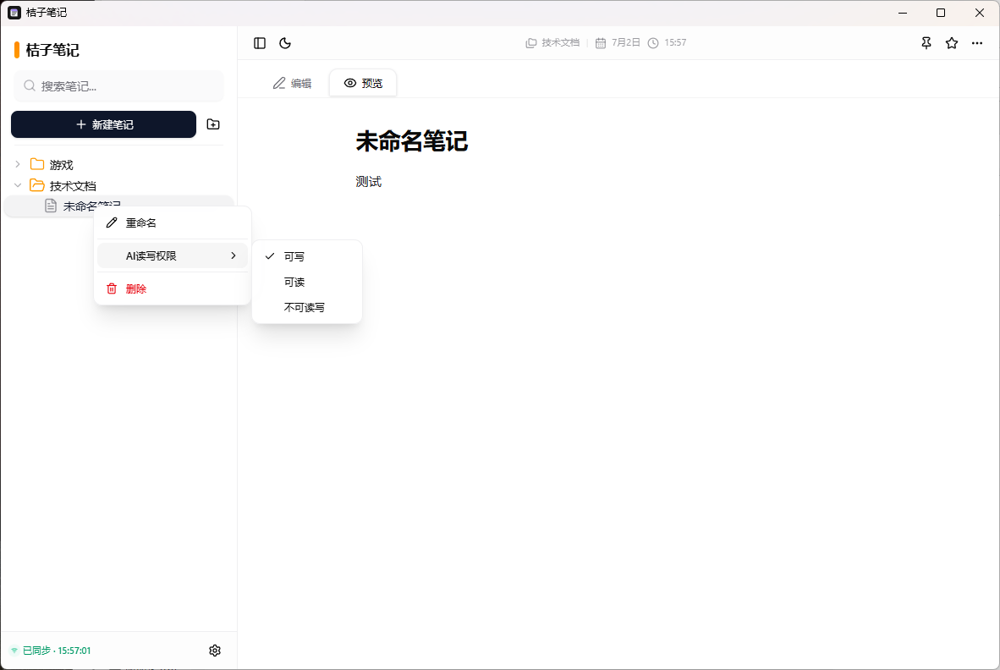

# 桔子笔记

桔子笔记是一款轻量、离线优先的桌面笔记应用，支持 Markdown 写作、图片粘贴、本地存储、局域网/服务器同步，以及面向 AI 的 MCP 协议访问能力。项目包含一个 Tauri 桌面客户端和一个 Rust 服务端，适合个人知识库、轻量文档管理和 AI 自动化读写笔记场景。



## 功能特性

- **本地优先**：笔记和图片优先保存在本机，SQLite 数据库目录与图片目录同级，方便迁移、备份和排查。
- **Markdown 写作**：支持编辑/预览切换、GitHub Flavored Markdown、代码高亮、任务列表和图片预览。
- **图片管理**：支持从剪贴板直接粘贴图片，图片以本地文件形式保存，并在笔记内容中引用。
- **文件夹管理**：支持多级文件夹、拖拽排序、跨文件夹移动、重命名和删除。
- **笔记管理**：支持新建、编辑、删除、置顶、收藏、标题自动保存和内容自动保存。
- **同步服务**：服务端提供 WebSocket 状态同步、附件上传下载、用户注册和后台管理接口。
- **MCP 支持**：AI 可通过 HTTP MCP 入口连接服务端，对授权笔记进行增删改查。
- **AI 权限控制**：文件夹和笔记可设置 AI 读写权限，包括可写、可读、不可读写。
- **访问令牌**：客户端设置页可生成专属 MCP Token，服务端通过 Token 校验访问权限。

## 项目结构

```text
.
├── orange-notes/          # Tauri + React 桌面客户端
│   ├── src/               # React 前端源码
│   ├── src-tauri/         # Tauri/Rust 本地能力与 SQLite 存储
│   └── package.json       # 前端构建脚本与依赖
├── orange-notes-server/   # Rust Axum 同步与 MCP 服务端
│   ├── src/               # 服务端源码
│   └── Cargo.toml         # 服务端依赖配置
├── screenshot/            # 项目截图
└── README.md
```

## 技术栈

### 客户端

- Tauri 2
- React 19
- TypeScript 6
- Vite 8
- Tailwind CSS 4
- Zustand
- react-markdown
- rusqlite

### 服务端

- Rust 2021
- Axum
- Tokio
- SQLite / rusqlite
- WebSocket
- MCP over HTTP
- Argon2 用户密码校验

## 快速开始

### 环境要求

- Node.js 24+
- npm
- Rust 稳定版
- Tauri 2 所需系统依赖

### 安装依赖

```bash
cd orange-notes
npm install
```

### 启动桌面客户端

```bash
cd orange-notes
npm run tauri:dev
```

仅调试前端界面时也可以运行：

```bash
cd orange-notes
npm run dev
```

### 构建客户端

```bash
cd orange-notes
npm run tauri:build
```

构建产物由 Tauri 输出到 `orange-notes/src-tauri/target/` 下。

## 启动服务端

服务端默认监听 `0.0.0.0:8777`。

```bash
cd orange-notes-server
cargo run
```

默认数据库文件为当前运行目录下的 `notes.sqlite`。如需指定数据库路径，可设置 `DATABASE_URL`：

```bash
DATABASE_URL=/path/to/notes.sqlite cargo run
```

Windows PowerShell：

```powershell
$env:DATABASE_URL="D:\data\orange-notes\notes.sqlite"
cargo run
```

### 后台管理

服务端提供后台管理页面：

```text
http://服务器IP:8777/admin
```

建议生产环境设置 `ADMIN_TOKEN`，避免后台接口裸露：

```powershell
$env:ADMIN_TOKEN="your-admin-token"
cargo run
```

## 同步与 MCP

### 客户端同步

在客户端设置弹窗中填写服务端地址、用户名和密码后，可以进行笔记与图片同步。服务端同时提供附件上传、下载、删除接口，用于同步笔记中的图片资源。

### MCP 连接

客户端可以在设置弹窗中生成专属 MCP Token。AI 客户端可通过以下地址连接：

```text
http://服务器IP:8777/mcp?token=你的Token
```

当前 MCP 工具包括：

- `list_folders`：列出可读文件夹。
- `list_notes`：分页列出笔记摘要，支持 `limit`、`offset`、`page`、`pageSize`、`folderId`、`folderName` 和搜索参数。
- `get_note`：按 ID 获取单篇笔记完整内容。
- `create_note`：创建笔记，支持指定 `folderId` 或 `folderName`。
- `update_note`：更新笔记内容、标题、排序、收藏、置顶或移动到指定文件夹。
- `delete_note`：删除指定笔记。

MCP 工具定义会通过 `tools/list` 和 `GET /mcp` 暴露完整 `inputSchema`，客户端更新工具 schema 后需要重新连接服务端。

## 数据存储

客户端使用 SQLite 保存笔记数据，图片以文件形式保存在 `img` 目录中。数据库目录与 `img` 目录同级，便于整体复制、备份和恢复。

服务端默认使用 SQLite 文件保存用户、文件夹、笔记、同步状态和 MCP Token。生产环境建议将数据库文件放在稳定的数据目录，并对该目录做定期备份。

## 常用脚本

### 客户端

```bash
cd orange-notes
npm run dev          # 启动 Vite 开发服务
npm run tauri:dev    # 启动 Tauri 桌面开发环境
npm run build        # 构建前端资源
npm run tauri:build  # 构建桌面应用
npm run lint         # 运行 oxlint
```

### 服务端

```bash
cd orange-notes-server
cargo run    # 启动服务
cargo check  # 类型与编译检查
cargo build  # 构建服务端
```

## 开发说明

- 客户端 UI 避免放置多余说明文字，优先保证布局清爽和笔记阅读体验。
- 与笔记相关的长期数据应进入 SQLite 或图片目录，不应依赖临时内存状态。
- MCP 参数变更时，必须同时更新业务逻辑和工具 `inputSchema`，否则客户端会出现 schema 校验失败。
- 服务端接口变更后，建议重启服务端并让 MCP 客户端重新连接，避免继续使用旧工具定义缓存。

## 许可证

本项目基于 [MIT License](LICENSE) 开源。
